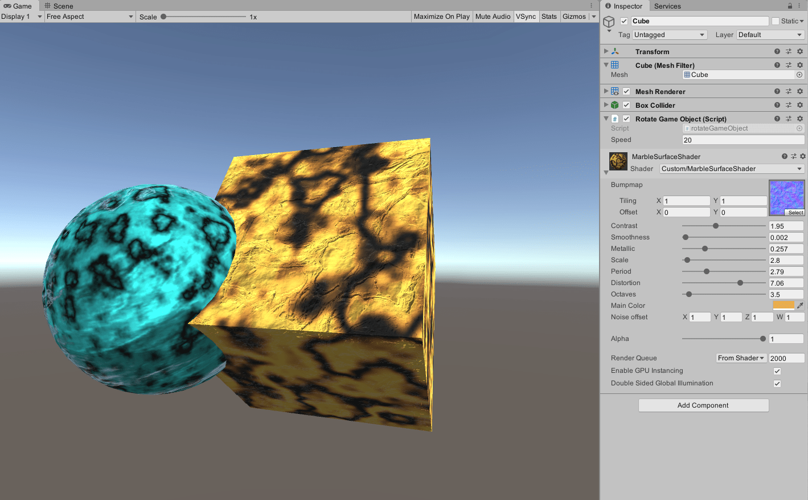

# Marble Shader v1.1

Unity marble surface shader.

### Display

### Usage

* requires Unity 5.6
* attach MarbleSurfaceShaser.shader to a material

### Change Log
* v1.1 now has bumpmap and constast.
* v1.0 first commit
